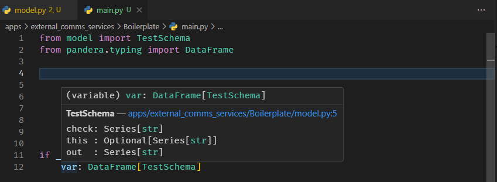

# Pandera Schema Hover

**See a pandera schema's columns right where you use the DataFrame. No jumping to the definition.**

With [pandera](https://pandera.readthedocs.io/), a hover over a typed DataFrame only tells you the
schema's *name*:

```text
(variable) orders: DataFrame[OrderSchema]
```

To know which columns `orders` actually has, you have to go find `OrderSchema`. This extension
adds the columns to the same hover:



```text
OrderSchema — models/orders.py:9
id        : Series[int]
customerId: Series[int]
couponId  : Optional[Series[pd.Int64Dtype]]  # nullable=True
status    : Series[str]  # isin=["OPEN", "SHIPPED", "CANCELLED"]
total     : Series[float]  # ge=0
```

## Features

- **Works anywhere the type shows up:** variables, function parameters, return values,
  attributes. If the hover says `DataFrame[Schema]`, you get the columns.
- **Always current:** columns are read from the schema's source on every hover, including
  unsaved edits. There's no copy that can drift.
- **Follows column changes:** if a variable's columns change after it got its schema
  (`df = df.drop(columns=[...])`, `df["new"] = ...`), hovering it later shows the schema with
  those changes applied. See [Column changes](#column-changes).
- **Inheritance:** a schema that subclasses another one shows the inherited columns too.
- **`Field(...)` constraints** like `nullable=True`, `ge=0` and `isin=[...]` are shown next to
  each column.
- **Jump to the schema:** the schema name in the hover links to its definition.
- **pandas, Polars and GeoPandas:** `DataFrame[...]`, `LazyFrame[...]` and
  `GeoDataFrame[...]` from `pandera.typing` are all recognised.
- **Read-only and safe:** it never runs your code or imports Python. It only reads source text,
  so it also works in untrusted workspaces.

## Column changes

A type checker only knows `DataFrame[OrderSchema]`, not which columns are still there. After
`df = df.drop(columns=[...])` the hover shows either a plain `DataFrame` or, worse, the original
schema. So the extension follows the variable back through its function (or the module) to
where it got its schema, and applies every column change it can read from the code since then:

```python
def clean(orders: DataFrame[OrderSchema]):
    orders = orders.drop(columns=["status"])           # line 2
    orders = orders.rename(columns={"total": "amount"})
    orders["discount"] = 0
    return orders                                       # hover `orders` here
```

```diff
  id        : Series[int]
  customerId: Series[int]
  couponId  : Optional[Series[pd.Int64Dtype]]  # nullable=True
- status    : Series[str]  # dropped, line 2
! amount    : Series[float]  # ge=0; renamed from total, line 3
+ discount  # added, line 4
```

A hover on the assignment target (`orders` left of the `=`) shows the result of that line. A
hover on a use of the variable shows its columns at that point.

A new variable made from another one is followed back too, and a column selection shows only
the selected columns, in the order they were selected:

```python
async def add_companies(self, companies: DataFrame[CompanySchema]):
    names = companies[["companyName", "issuerId"]]    # hover `names`
```

```diff
  companyName: Series[str]
  issuerId   : Series[int]
```

**pandas:** `drop` (with `columns=` or `axis=1`), `del df[...]`, `df["x"] = ...`,
`df.loc[:, "x"] = ...`, `assign`, `rename(columns=...)`, `df[["a", "b"]]`,
`df.loc[rows, [...]]`, `filter(items=...)`, `set_index`, `reindex(columns=...)`, `pop`,
`insert`, `df.columns = [...]` and `inplace=True`.
**Polars:** `select`, `with_columns` (names from `alias`, `pl.col` and keyword arguments),
`drop`, `rename` and `with_row_index`. Methods that keep the columns as they are, like
`sort_values`, `dropna`, `filter`, `copy` and `collect`, pass through.

The extension never guesses:

- Changes inside an `if` or a loop that the hovered line isn't in are marked `!`, as *maybe*
  dropped or added. Arms of the same `if`/`elif`/`else` that exclude each other are skipped.
- Column names that aren't literals (`df.drop(columns=to_drop)`), `merge`/`join`,
  `reset_index()` and unknown methods are listed under the schema as notes.
- `groupby`, `pivot`, `melt`, aggregations and any other reassignment start over. From that
  line on the hover shows whatever type the language server reports.
- Positional `drop("a")` and `rename({...})` mean rows in pandas but columns in Polars. The
  library is worked out from the file's imports. If both are imported, the call is listed as
  a note.

## Requirements

A Python language server that shows types on hover. **Pylance** (the default with the
Microsoft Python extension) and **basedpyright** both work. The extension adds to their hover
and doesn't replace it.

Your variables need a pandera type the language server can see, e.g.
`def load() -> DataFrame[OrderSchema]` or `orders: DataFrame[OrderSchema] = ...`. A plain
`pd.DataFrame` has no schema to show.

## Settings

| Setting | Default | Description |
|---|---|---|
| `panderaHover.exclude` | `venv`, `.venv`, `node_modules`, `site-packages`, `__pycache__` | Globs skipped when a schema has to be found by scanning `.py` files. Scanning is only a fallback, used when the language server's workspace symbols don't find the class. Add large data or vendored folders here. |

## Known limitations

- If two schema classes share a name, the one in the current file wins, then any in your
  workspace. Otherwise the first one found is shown.
- Columns are read from the class body as written. Columns added dynamically at runtime aren't
  shown.
- Column changes are followed only for plain variables within one function. Changes made
  through another name (`other = df; other.drop(..., inplace=True)`), inside a called function,
  or to an attribute like `self.df` aren't seen.

## Contributing

Issues and PRs are welcome at
[github.com/liadyar/pandera-hover](https://github.com/liadyar/pandera-hover).

```bash
npm test          # parser tests: plain node, no VS Code needed
npm run package   # builds pandera-hover-<version>.vsix
```

To try a local build: `code --install-extension pandera-hover-<version>.vsix --force`, then
**Developer: Reload Window**.

## License

[MIT](LICENSE)
